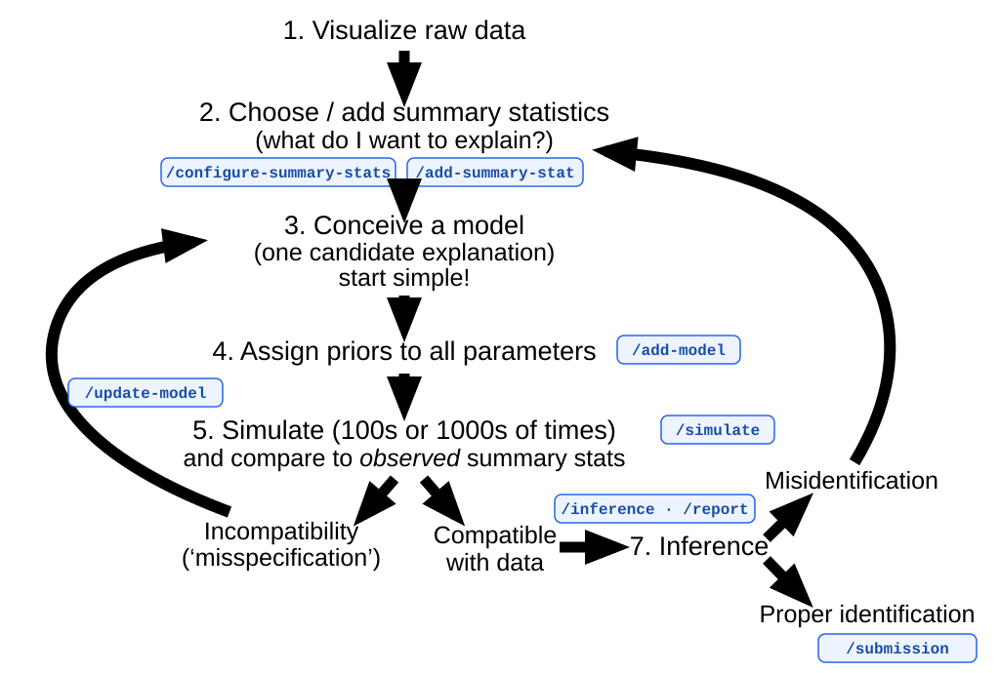

# Bayesian agent-based modeling

Code and data for simulation-based Bayesian modelling with PyMC and
BayesFlow.



The workshop follows an iterative model-building cycle. Work in Cursor: the
slash commands below are the main interface. `/report` combines simulation,
inference, and diagnostics once a model is ready to evaluate.

## Table of contents

- [Workshop in Cursor](#workshop-in-cursor)
- [Choose summary statistics](#choose-summary-statistics)
- [Shared compute](#shared-compute)
- [Local installation](#local-installation)
- [Local CLI](#local-cli)

## Workshop in Cursor

Run these commands in chat.

| Task | Command | Output |
| --- | --- | --- |
| Test SSH key, instance, and connection | `/test` | Chat only |
| Configure summary statistics | `/configure-summary-stats [MODEL_OR_DATASET]` | `.config/summary.ini` |
| Add a summary statistic | `/add-summary-stat` | `datasets/<dataset>/summaries.py` and tests |
| Add a model | `/add-model` | `models/<dataset>/` and tests |
| Update a model | `/update-model` | Existing model files |
| Run prior-predictive simulations | `/simulate MODEL [OPTIONS]` | `output/<model>/simulations.png` |
| Run posterior inference | `/inference MODEL [OPTIONS]` | `output/<model>/` |
| Generate a model report | `/report MODEL [OPTIONS]` | `reports/<model>/` |
| Submit a model and report | `/submission MODEL` | `submissions/<model>` branch |

`/test` checks that the workshop SSH key can be accessed, that the
[shared AWS instance](scripts/aws/README.md) is running, and that SSH to
it works. It does not run a local simulation or inference smoke test. A
failed check is a test failure; the instance is not started automatically.

`/simulate`, `/inference`, and `/report` prefer the [shared AWS
instance](scripts/aws/README.md) (`--cpus 16`) and fall back to this machine
(`--cpus 4`) if SSH is unavailable.

A typical loop:

1. `/test` to confirm the SSH key, running instance, and connection.
2. `/configure-summary-stats` for the dataset you are working on.
3. `/add-model` or `/update-model` as you design the process.
4. `/simulate`, then `/inference` or `/report`.
5. `/submission` when the model and report should be handed in.

`/add-model` and `/add-summary-stat` ask for the statistical specification
before editing code. `/add-model` follows
[SKILLS/add-new-model/SKILL.md](SKILLS/add-new-model/SKILL.md);
`/add-summary-stat` follows
[SKILLS/add-summary-statistic/SKILL.md](SKILLS/add-summary-statistic/SKILL.md).

## Choose summary statistics

Simulation and inference need an explicit, local selection of summary
statistics for the dataset used by the requested model. The selection lives
in `.config/summary.ini` and is intentionally not committed.

Run `/configure-summary-stats` and name a model or dataset. Cursor will
explain the recommended starting set and wait for confirmation before writing
the file. Recommendations are starting points, not mandatory choices. There
is no maximum number of enabled statistics.

For contacts, the proposed starting configuration is:

```ini
[contacts]
enabled =
    cumulative_network_connectivity
    cumulative_network_clustering
    cumulative_network_degree_variance
```

Story models start with total activity, concentration, and temporal
persistence. Scientist-convention models start with coauthorship coupling,
citation coupling, and the theory-HEP field effect. The exact names,
recommendations, and complete option lists are documented in
`.config/summary.example.ini`.

If none of the existing options captures the feature you care about, run
`/add-summary-stat`. If the relevant selection is missing, empty, duplicated,
or unknown, the command stops before simulation and proposes
`/configure-summary-stats`.

`/report` writes `reports/<model>/report.md` with a model description, a
summary-statistics table, a prior table, prior-predictive and
prior/posterior figures, an optional posterior-predictive figure, and
inference diagnostics. It reuses the inference network's training simulations
for the prior-predictive pairplot and the prior cloud of the
posterior-predictive pairplot.

## Shared compute

Heavy Cursor commands run on a shared AWS instance when it is reachable.
Start and stop that instance, instructor setup, credentials, and IAM are
documented in [scripts/aws/README.md](scripts/aws/README.md).

## Local installation

This project requires **Python 3.11, 3.12, or 3.13**
(`>=3.11,<3.14`). This range is imposed by the pinned
[BayesFlow 2.0.12](https://bayesflow.org/v2.0.12/) dependency. Python 3.12 is
recommended.

### Conda (recommended)

```bash
conda create --name bayesian-modelling python=3.12 pip
conda activate bayesian-modelling

python -m pip install --upgrade pip
python -m pip install -r requirements.txt
python -m pip install jax
```

BayesFlow requires a Keras backend. JAX is the recommended backend in the
[BayesFlow installation guide](https://bayesflow.org/v2.0.12/). Configure it
for this Conda environment, then reactivate so the setting takes effect:

```bash
conda env config vars set KERAS_BACKEND=jax
conda deactivate
conda activate bayesian-modelling
```

The command above installs the standard CPU build of JAX. For an NVIDIA GPU
or another accelerator, follow the
[JAX platform-specific installation instructions](https://docs.jax.dev/en/latest/installation.html)
instead of `python -m pip install jax`.

Verify the environment:

```bash
python -c "import bayesflow, jax, pymc, keras; print(keras.backend.backend())"
```

The command should print `jax`.

### `venv`

```bash
python3.12 -m venv .venv
source .venv/bin/activate

python -m pip install --upgrade pip
python -m pip install -r requirements.txt
python -m pip install jax
export KERAS_BACKEND=jax
```

Set `KERAS_BACKEND=jax` before importing BayesFlow in each new shell, or add
it to the shell's environment configuration.

## Local CLI

CLI scripts always run on this machine and default to `--cpus 4`. Run them
from the repository root after activating the project environment.
`python scripts/<command>.py --help` lists accepted options.

| Task | Command |
| --- | --- |
| Test SSH key, instance, and connection | `python scripts/test.py` |
| Configure summaries | Copy `.config/summary.example.ini` to `.config/summary.ini` and edit the dataset's `enabled` list |
| Simulate | `python scripts/simulate.py MODEL [OPTIONS]` |
| Infer | `python scripts/inference.py MODEL [OPTIONS]` |
| Report | `python scripts/report.py MODEL [OPTIONS]` |
| Compare models | `python scripts/model-comparison.py MODEL [MODEL ...] [OPTIONS]` |

```bash
python scripts/simulate.py latent_network
python scripts/inference.py latent_network
python scripts/report.py latent_network
python scripts/model-comparison.py reputation_conversation latent_network
```
