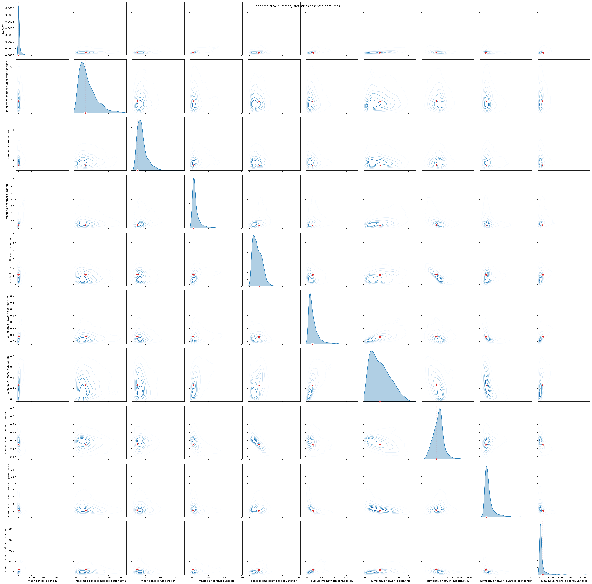
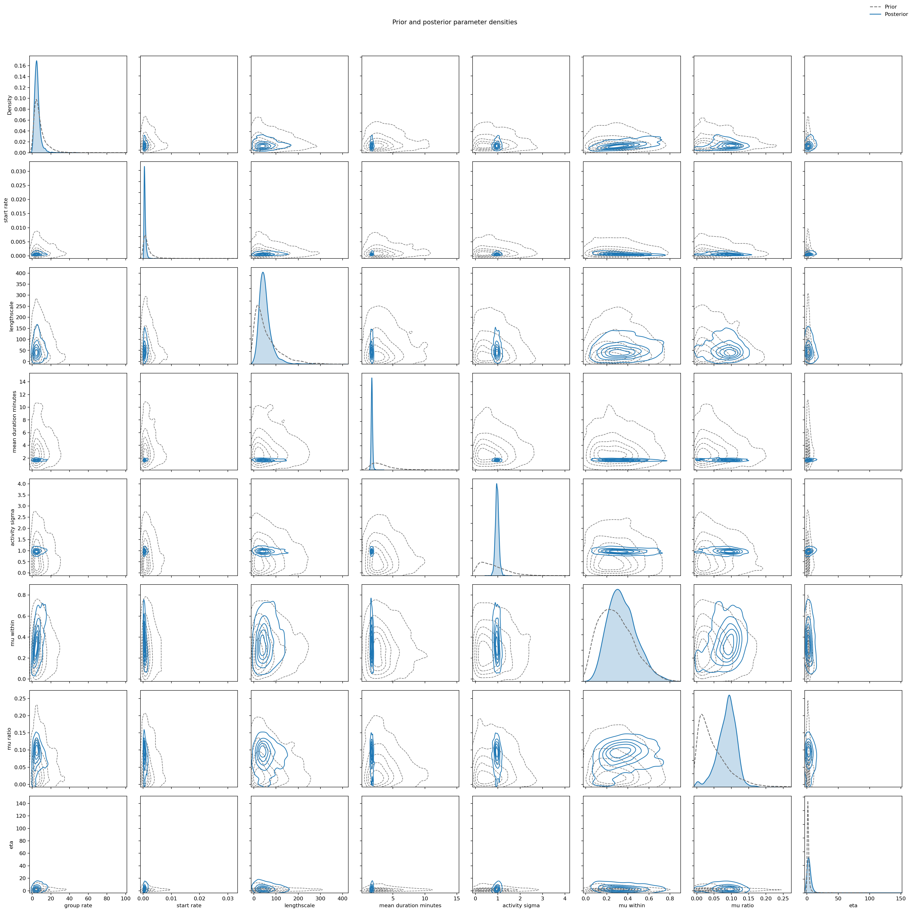
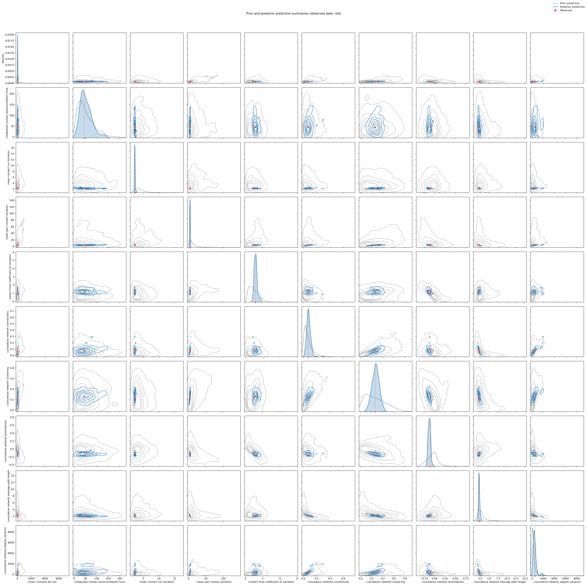
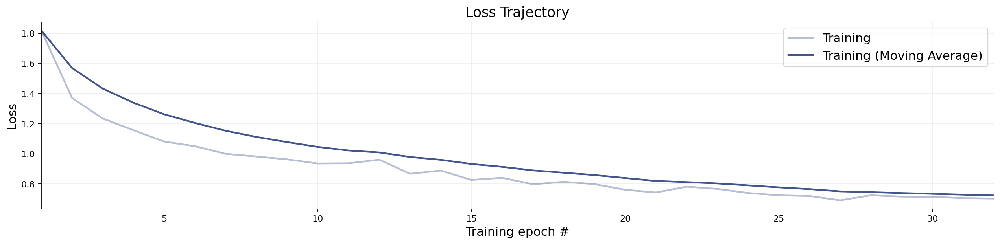
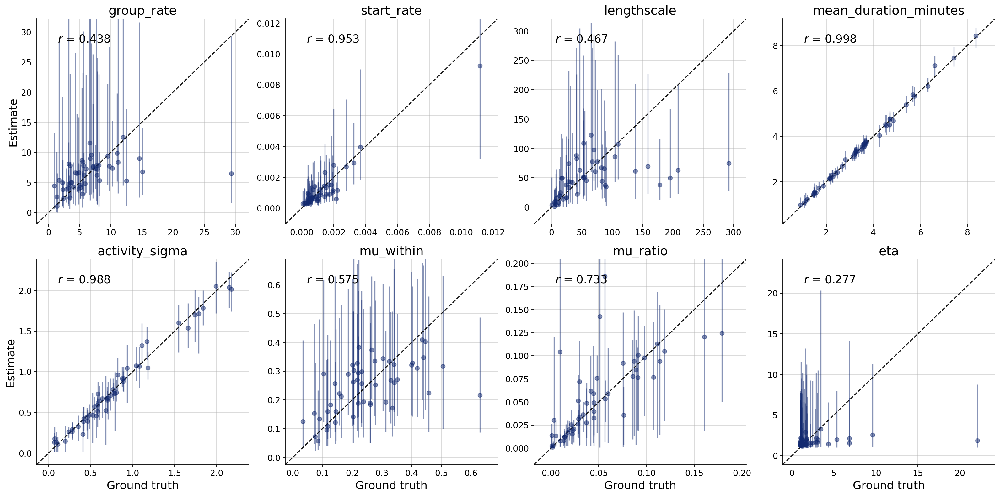
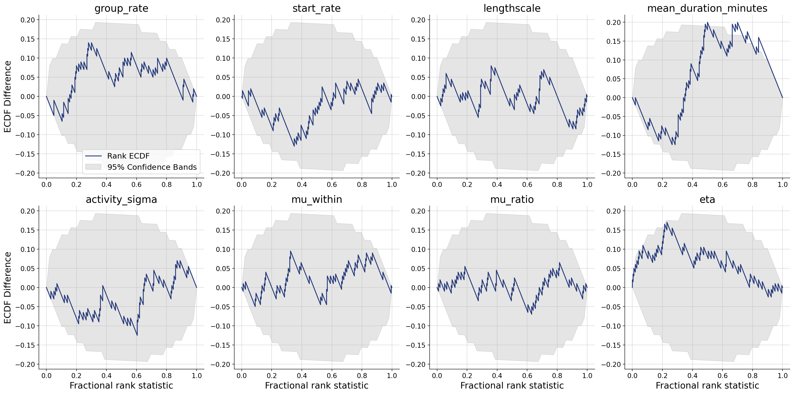
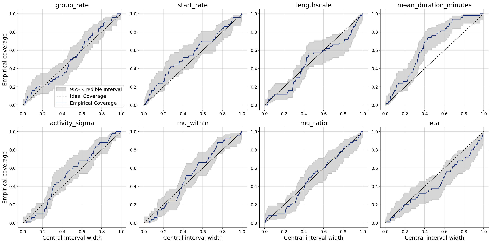
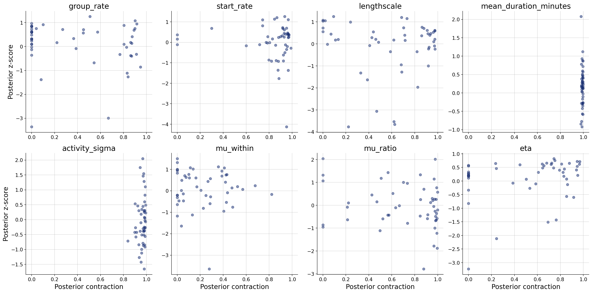

# Model report: Latent Network Gravity

## Model description

People in a finite population form minute-by-minute pairwise contacts. Each person is assigned to a latent social group and given a stable activity level (log-normal agent gravity), so some individuals are systematically more likely to appear in conversations. Whether two people start talking depends on a lasting pair affinity—higher on average inside a group than across groups (Beta affinities around within- and between-group means)—multiplied by the product of their activities; new conversations then begin as Poisson events among currently idle pairs, persist for a random run of minutes, and end. The overall pace of those starts wanders smoothly through the observation window (an Ornstein–Uhlenbeck process on the log start rate).

## Summary statistics

Summary statistics reduce the observed data to the scalar features used for simulation-based inference. The values below are computed from the observed dataset.

| Statistic | Description | Value |
| --- | --- | ---: |
| `mean_contacts_per_bin` | Mean concurrent contacts across fixed time bins | 33.3205 |
| `integrated_contact_autocorrelation_time` | The initial-positive-sequence IACT of contact counts | 44.8481 |
| `mean_contact_run_duration` | Mean consecutive minutes a pair stays in contact | 2.28789 |
| `mean_pair_contact_duration` | Mean total minutes of contact among pairs that ever meet | 4.30237 |
| `contact_time_coefficient_of_variation` | Relative heterogeneity in cumulative agent contact time | 1.15053 |
| `cumulative_network_connectivity` | The density of the cumulative binary contact network | 0.0722572 |
| `cumulative_network_clustering` | Mean local clustering of the cumulative contact network | 0.262099 |
| `cumulative_network_assortativity` | Degree assortativity of the cumulative contact network | -0.0968118 |
| `cumulative_network_average_path_length` | Mean shortest-path length in the largest component | 2.16222 |
| `cumulative_network_degree_variance` | Population variance of unique-neighbor degrees, including isolates | 492.885 |

## Parameters and prior distributions

Parameters describe individual or population traits, strategies, environmental features, or latent social structure. Their priors are sampled anew for each simulation; the mean and sigma below are the implied moments on the parameter's natural scale.

| Parameter | Prior | Mean | Sigma | Unit |
| --- | --- | ---: | ---: | --- |
| `group_rate` | `LogNormal(mu=1.79, sigma=0.75)` | 7.95 | 6.91 | groups |
| `start_rate` | `LogNormal(mu=-6.91, sigma=1)` | 0.00165 | 0.00216 | per minute |
| `lengthscale` | `Exponential(lam=0.0167)` | 60 | 60 | minutes |
| `mean_duration_minutes` | `LogNormal(mu=1.1, sigma=0.5)` | 3.4 | 1.81 | minutes |
| `activity_sigma` | `HalfNormal(sigma=1)` | 0.798 | 0.603 | — |
| `mu_within` | `Beta(alpha=2, beta=5)` | 0.286 | 0.16 | — |
| `mu_ratio` | `Beta(alpha=1, beta=20)` | 0.0476 | 0.0454 | — |
| `eta` | `Pareto(alpha=1.5, m=1)` | 3 | ∞ | — |

## Prior-predictive summary statistics

The pairplot shows the joint distribution of the selected summary statistics under repeated prior simulations (`mean_contacts_per_bin`, `integrated_contact_autocorrelation_time`, `mean_contact_run_duration`, `mean_pair_contact_duration`, `contact_time_coefficient_of_variation`, `cumulative_network_connectivity`, `cumulative_network_clustering`, `cumulative_network_assortativity`, `cumulative_network_average_path_length`, `cumulative_network_degree_variance`), with the observed summaries overlaid. Marginal or pairwise incompatibility indicates model misspecification.

## Prior and posterior parameter distributions

Simulation-based inference uses the observed summary statistics $S$ to update the prior $P(θ)$ to the posterior $P(θ \mid S)$. Comparing the two distributions shows the direction and extent of parameter learning supplied by the data.

## Posterior-predictive summary statistics

Posterior parameter draws are propagated through the simulator and summarization pipeline. Comparing their marginal and pairwise distributions with the observed summaries tests whether the inferred model reproduces the macro-level patterns it was intended to explain.

## Inference and identification diagnostics

These diagnostics assess whether simulation-based inference is reliable and whether the parameters are properly identified. They help distinguish incompatibility with the data (misspecification) from compatibility without unique parameter recovery (missidentification), which should be resolved before substantive interpretation.

### Losses

### Recovery

### Calibration ECDF

### Coverage

### Z-score contraction

