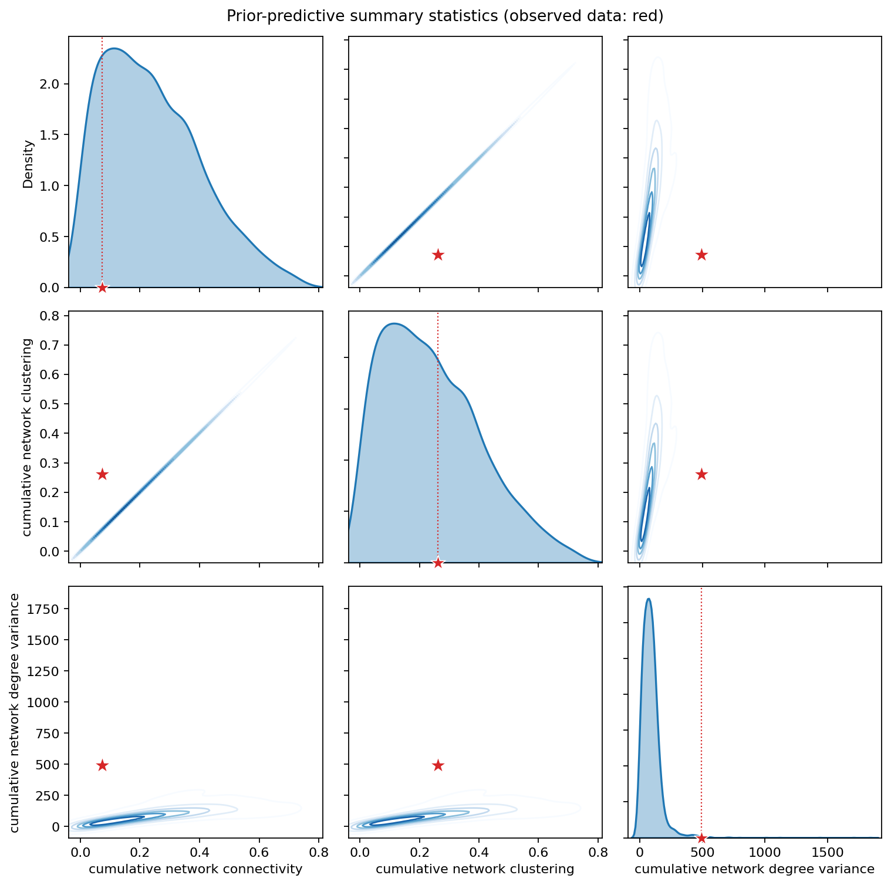
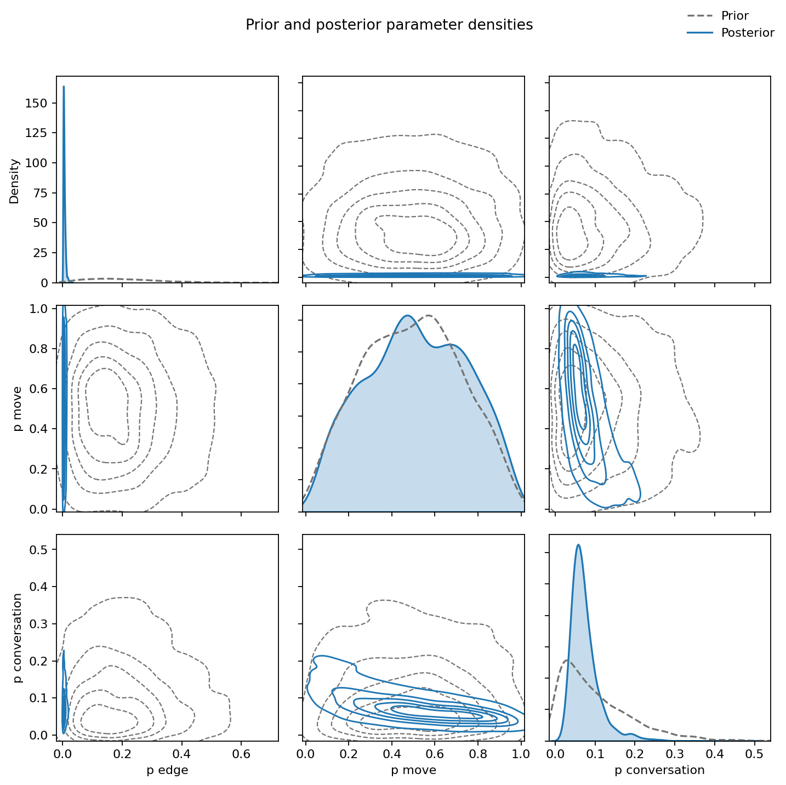
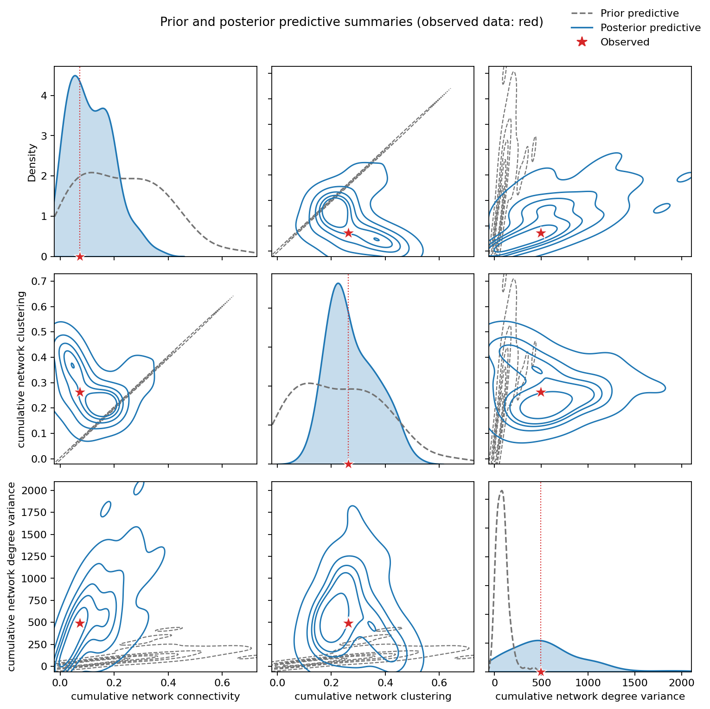
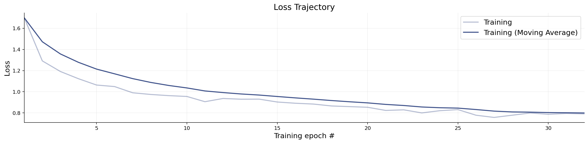
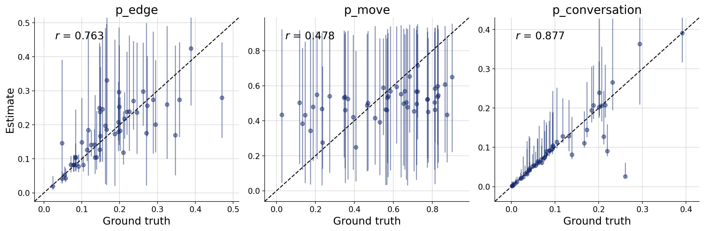
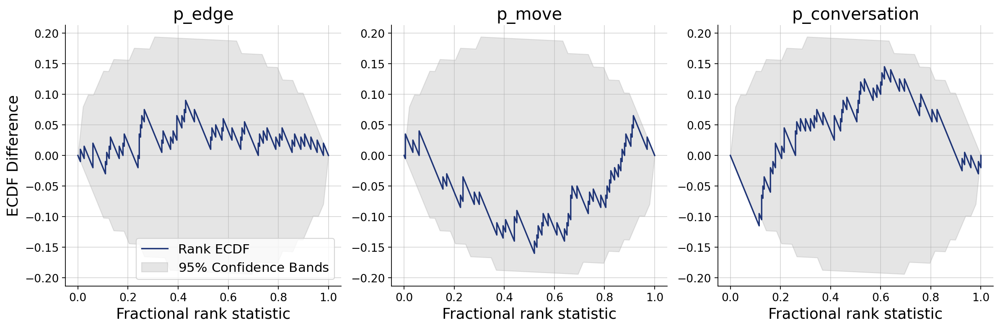
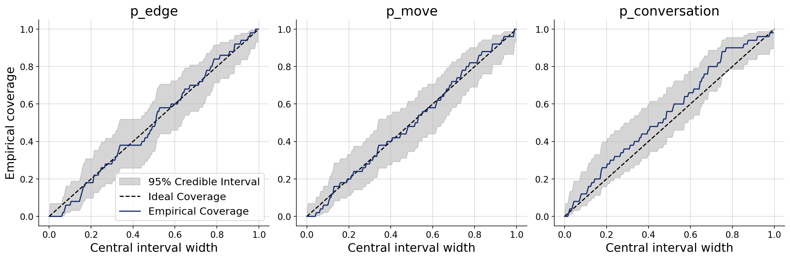
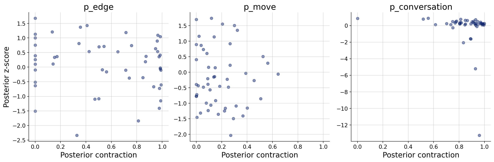

# Model report: Random Walk

## Model description

Each person has a home on a hidden undirected graph whose possible friendships are included independently with a shared probability `p_edge` (a Bernoulli / Erdős–Rényi network). Every minute, each person's walker independently stays put or steps to a neighboring home (`p_move`), so meetings can occur only along those latent edges. A conversation is recorded only when a walker is away from home and independently speaks with the resident of the node they occupy (`p_conversation`); if both directions fire in the same minute, the pair is counted once as an undirected contact. How connected, clustered, and uneven the resulting contact network is therefore depends on the realized graph and on those two per-minute probabilities, not on named individual traits beyond graph position.

## Parameters and prior distributions

Parameters describe individual or population traits, strategies, environmental features, or latent social structure. Their priors are sampled anew for each simulation; the mean and sigma below are the implied moments on the parameter's natural scale.

| Parameter | Prior | Mean | Sigma | Unit |
| --- | --- | ---: | ---: | --- |
| `p_edge` | `Beta(alpha=2, beta=8)` | 0.2 | 0.121 | — |
| `p_move` | `Beta(alpha=2, beta=2)` | 0.5 | 0.224 | probability per minute |
| `p_conversation` | `Beta(alpha=1, beta=9)` | 0.1 | 0.0905 | probability per minute |

## Prior-predictive summary statistics

The pairplot shows the joint distribution of the selected summary statistics under repeated prior simulations (`cumulative_network_connectivity`, `cumulative_network_clustering`, `cumulative_network_degree_variance`), with the observed summaries overlaid. Marginal or pairwise incompatibility indicates model misspecification.

## Prior and posterior parameter distributions

Simulation-based inference uses the observed summary statistics $S$ to update the prior $P(θ)$ to the posterior $P(θ \mid S)$. Comparing the two distributions shows the direction and extent of parameter learning supplied by the data.

## Posterior-predictive summary statistics

Posterior parameter draws are propagated through the simulator and summarization pipeline. Comparing their marginal and pairwise distributions with the observed summaries tests whether the inferred model reproduces the macro-level patterns it was intended to explain.

## Inference and identification diagnostics

These diagnostics assess whether simulation-based inference is reliable and whether the parameters are properly identified. They help distinguish incompatibility with the data (misspecification) from compatibility without unique parameter recovery (missidentification), which should be resolved before substantive interpretation.

### Losses

### Recovery

### Calibration ECDF

### Coverage

### Z-score contraction

